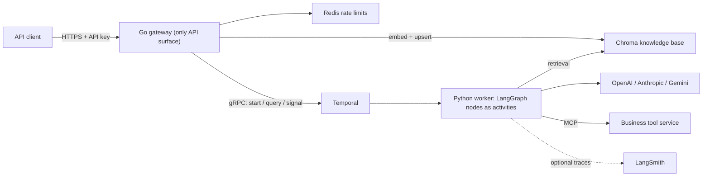
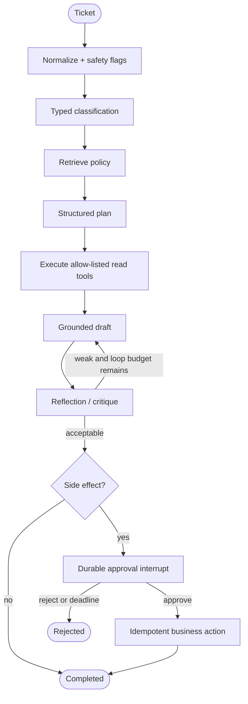

# Production Agentic AI Template

A production-oriented reference application for learning how an agent moves from a
notebook into a service. The business case is intentionally simple: receive a customer
support ticket, retrieve policy, inspect an order, draft and critique an answer, and
pause for human approval before issuing a refund.

The public API is Go — the only API surface, not a proxy. The agent runtime is Python
with LangChain, LangGraph, and LangSmith hooks, running as a Temporal worker: every
graph node executes as a Temporal activity with its own timeout and retry policy, and
Temporal's event history is what makes a multi-day approval pause durable. Retrieval
uses Chroma, edge rate limiting uses Redis, and business tools are served over MCP. All
external dependencies sit behind small interfaces so this repository can become the
starting point for another domain.

## What this demonstrates

| Concept | Concrete implementation |
|---|---|
| Reasoning and routing | Typed classification followed by an explicit graph plan |
| Planning | A structured `Plan` chooses a read tool or proposed business action |
| Tool use | Allow-listed LangChain tools; order lookup is supplied over MCP |
| RAG / knowledge base | Markdown policies embedded into Chroma and cited in answers |
| Reflection | A typed critique can send a weak draft through one bounded revision loop |
| Human in the loop | LangGraph `interrupt()` pauses refunds; a Temporal signal resumes them |
| Durable execution | Temporal event history persists every graph step and the approval pause |
| Retries and timeouts | Per-node activity retry policies; a flaky model call retries in isolation |
| Model portability | One adapter selects OpenAI, Anthropic, Google Gemini, or a test fake |
| Observability | Structured JSON logs, the Temporal Web UI, and opt-in LangSmith traces |
| Safeguards | Input limits, prompt-injection flags, delimited RAG context, tool allow-list |
| API hardening | Go edge API, typed validation, body limits, API key auth, Redis limits |
| Correctness | Python workflow tests on a time-skipping Temporal server, Go tests, and E2E |

The fake model and business actions are deterministic teaching adapters. They make the
entire workflow testable without API cost, but they must not be mistaken for production
AI or payment implementations.

## Architecture



The worker serves no HTTP. It polls a Temporal task queue, so it scales on queue
backlog rather than request concurrency, and a deploy can replace it mid-approval
without losing a ticket.



Each box above maps to a node in `graph/workflow.py`. Nodes marked
`execute_in: "activity"` become Temporal activities; the pause and the routers run
inline in the workflow. A completed refund's event history reads:

```
support.classify -> support.retrieve -> support.plan -> support.execute_read_tools
  -> support.draft -> support.reflect -> SIGNAL submit_decision -> support.apply_action
```

`apply_action` is a separate node from `approval` on purpose: the side effect can only
be scheduled after the signal, so no retry of the reasoning steps can ever re-enter it.

## Repository map and key entry points

```text
services/
  gateway/                  Go public API — validation, auth, rate limits, Temporal client
    internal/api/           The public contract; mirrors the Python schemas
    internal/tickets/       Start / query / signal the durable workflow
    internal/knowledge/     Embeddings + Chroma writes (ingestion lives here)
    internal/httpapi/       Routing, auth, error mapping
  agent/app/
    worker.py               Temporal worker entrypoint (start here)
    temporal/workflows.py   The durable workflow: pause, signal, approval deadline
    temporal/mapping.py     Pure graph-state -> API-state projection
    graph/workflow.py       The LangGraph workflow and per-node execution policy
    graph/state.py          Durable typed state passed between nodes
    core/models.py          Provider-neutral model adapter and typed outputs
    core/safety.py          Input and retrieved-context safety boundaries
    knowledge/repository.py Chroma retrieval (read side only)
    tools/registry.py       MCP loading, tool allow-list, idempotent actions
  mcp-tools/server.py       Standalone MCP business-tool example
data/knowledge/             Seed policy documents
tests/e2e/                  Public API lifecycle test
deploy/k8s/                 Portable production manifest
```

The best extension points are:

- `build_support_graph()` to add, remove, or reorder workflow capabilities.
- Node `metadata` in `graph/workflow.py` to change where a step runs and how it retries.
- `SupportModel` to add a provider or local model without changing graph nodes.
- `KnowledgeRepository` (Python, read) and `knowledge.Repository` (Go, write) to
  replace Chroma with pgvector or another store.
- `ToolRegistry` and the MCP server to connect real business systems.
- `require_approval_for` to change which actions require a reviewer.

Two constraints are worth knowing before you edit the graph, both enforced by the
Temporal LangGraph plugin:

- Node callables must be importable from a named module. That is why the nodes are
  methods on `SupportNodes` rather than closures — closures and lambdas are rejected.
- Conditional-edge routers must be `async def`. LangGraph dispatches a sync router
  through `run_in_executor`, which the deterministic workflow event loop does not
  implement.

## Quick start

Requirements: Docker with Compose. For local development without containers, install
Python 3.13, `uv`, and Go 1.26.

```bash
cp .env.example .env
# Put OPENAI_API_KEY in .env (never commit it).
docker compose up --build -d --wait
make seed
```

`OPENAI_API_KEY` is required even when the chat provider is Anthropic or Gemini:
knowledge ingestion embeds through OpenAI.

The public API is at `http://localhost:8080`. The Temporal Web UI is at
`http://localhost:8233` (`make ui`) — open it to watch a run's activities, its pause,
and the signal that resumes it.

Runs are durable and asynchronous, so creating a ticket returns immediately and you poll
for progress:

```bash
curl -sS http://localhost:8080/v1/tickets \
  -H 'X-API-Key: local-api-key' \
  -H 'Content-Type: application/json' \
  -d '{
    "customer_id": "customer-42",
    "message": "Where is my order?",
    "order_id": "order-123"
  }'
# -> 202 {"ticket_id":"ticket-...","status":"running"}

curl -sS http://localhost:8080/v1/tickets/TICKET_ID -H 'X-API-Key: local-api-key'
# -> {"status":"completed","answer":"...","citations":["shipping-policy"]}
```

A refund request reaches `waiting_approval` with a `pending_action`. Resume the same
durable run with:

```bash
curl -sS http://localhost:8080/v1/tickets/TICKET_ID/decision \
  -H 'X-API-Key: local-api-key' \
  -H 'Content-Type: application/json' \
  -d '{"decision":"approve","reviewer":"manager-7","comment":"Policy verified"}'
# -> 202; poll GET again until "completed"
```

To see durability rather than take it on trust, pause a refund, then run
`docker compose restart worker` and approve it. The run resumes on a brand-new process.

Stop the stack with `make down`. Add `-v` to `docker compose down` only when you
intentionally want to delete local Temporal, Chroma, and Redis data.

## Logging

```bash
docker compose logs -f gateway worker
```

The Temporal Web UI at `http://localhost:8233` is usually the faster way to debug a run:
it shows every activity, its attempts, its input and output, and where a run is parked.

## API

| Method | Route | Purpose | Success |
|---|---|---|---|
| `GET` | `/healthz` | Gateway liveness | `200` |
| `GET` | `/readyz` | Gateway readiness, including Temporal reachability | `200` / `503` |
| `POST` | `/v1/tickets` | Start a durable support run | `202` |
| `GET` | `/v1/tickets/{ticket_id}` | Read current/completed run state | `200` |
| `POST` | `/v1/tickets/{ticket_id}/decision` | Approve or reject a pending action | `202` |
| `POST` | `/v1/knowledge` | Upsert knowledge documents | `200` |

Statuses are `running`, `waiting_approval`, `completed`, and `rejected`. A decision on a
run that is not paused returns `409`; an unknown ticket returns `404`.

All routes except health require `X-API-Key` or `Authorization: Bearer ...`. In a real
customer application, replace the shared key with JWT/OAuth validation at the gateway.
There is no second internal API key any more: the gateway reaches the agent over
Temporal's authenticated gRPC connection, and the worker exposes no port at all.

Because `GET /v1/tickets/{id}` is served by a Temporal query, it needs a live worker to
answer. With every worker down the gateway correctly reports `502`.

## Model configuration

The default is OpenAI:

```dotenv
MODEL_PROVIDER=openai
MODEL_NAME=gpt-5-mini
OPENAI_API_KEY=...
```

Change only configuration to try another installed provider:

```dotenv
MODEL_PROVIDER=anthropic
MODEL_NAME=claude-sonnet-4-6
ANTHROPIC_API_KEY=...
```

or:

```dotenv
MODEL_PROVIDER=google
MODEL_NAME=gemini-3.1-pro-preview
GOOGLE_API_KEY=...
```

Model names evolve faster than application code, so verify availability in your account
before deployment. `MODEL_PROVIDER=fake` is reserved for tests and demos.

Retrieval uses OpenAI `text-embedding-3-small` independently of the chat provider.
`EMBEDDING_MODEL` and `CHROMA_COLLECTION` must hold the same value on the gateway and
the worker: the gateway writes the vectors the worker queries, and a mismatch degrades
retrieval silently rather than loudly.

## LangSmith

LangChain/LangGraph automatically picks up the standard tracing environment variables
inside activities:

```dotenv
LANGSMITH_TRACING=true
LANGSMITH_API_KEY=...
LANGSMITH_PROJECT=support-agent-template
```

Temporal also ships a LangSmith plugin, but this project does not use it: its extra pins
`langsmith<0.9` while `langchain-core` requires `>=0.3.45,<1.0.0`, so installing it would
force an unsatisfiable resolution. The environment variables above cover the same ground.

Create separate projects for development, staging, and production. Before sending real
customer traffic, define a redaction/sampling policy and build a LangSmith dataset from
the deterministic test cases plus anonymized failures. Useful evaluation dimensions are
groundedness, citation correctness, correct tool selection, approval compliance, answer
quality, latency, and cost.

## Tests and quality checks

Install the locked toolchain and dependencies:

```bash
make install
```

Run fast checks:

```bash
make lint
make test-unit
```

Python workflow tests run against Temporal's time-skipping test server, so the 72-hour
approval deadline resolves in milliseconds and the whole suite finishes in seconds. No
Temporal server or Docker is needed.

Run the real public API against the container stack (fake chat model, real gateway,
Temporal, Chroma, Redis, MCP startup, and approval resume):

```bash
make test-e2e
```

This one does need `OPENAI_API_KEY`: the chat model is faked, but retrieval uses real
embeddings, and proving that the gateway's writes are readable by the worker is much of
the point of the E2E suite.

Python tests cover graph routing, RAG boundaries, safeguards, the approval deadline, and
signal handling. Go tests cover edge authentication, request validation, HTTP error
mapping, and the exact Chroma/embeddings wire format. CI repeats these checks, runs Go's
race detector, and builds all application images.

## Production deployment

Use Temporal Cloud or a self-hosted Temporal cluster; use managed Redis; use Chroma Cloud
or a persistent Chroma deployment. Run the gateway publicly and keep the worker and MCP
tool service on private networking — the worker needs no ingress whatsoever. The portable
Kubernetes example and cloud-service mapping are in [`docs/deployment.md`](docs/deployment.md).

Production work that is intentionally left domain-specific:

- Replace the deterministic order and refund implementations with authenticated APIs.
- Store refund idempotency in the destination business system, not process memory.
- Add tenant-aware JWT authorization and tenant-scoped knowledge filtering.
- Add provider moderation and organization policy checks for your risk profile.
- Set a Temporal retention policy and archival for closed workflow histories.
- Add streaming only after the approval UX and error semantics are settled.

## Why the services are split

Go owns the stable, high-concurrency public contract and every cross-cutting edge
concern: authentication, validation, rate limiting, HTTP semantics, and knowledge
ingestion, which is plain CRUD and needs no workflow. Python owns the fast-moving model
ecosystem and the LangGraph reasoning. Temporal sits between them and owns durability,
retries, timeouts, and the human pause — which is why there is no application database
here at all, and why a refund can wait three days for a reviewer across any number of
deploys. MCP keeps business tools independent of the agent process. Redis handles only
disposable edge counters; Chroma is hidden behind a repository interface on both sides.

This separation gives future projects clear seams without turning a small teaching
example into a large microservice estate.
