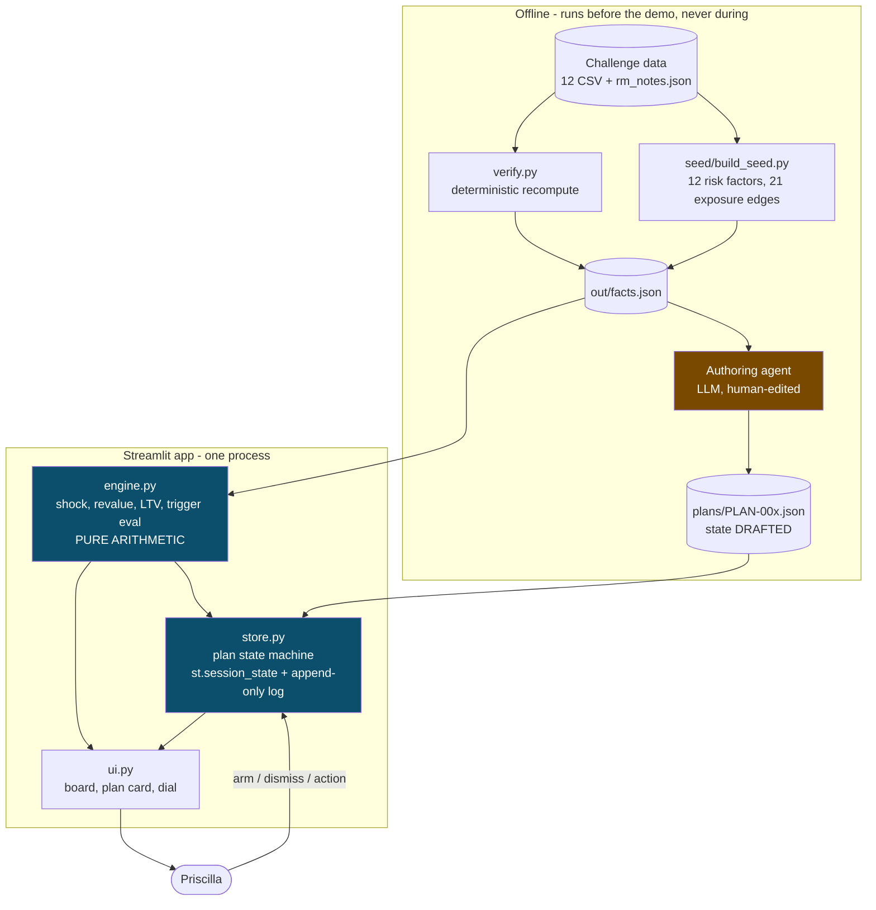
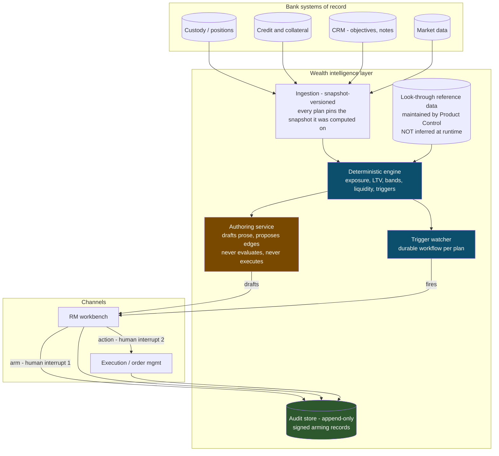

# Architecture

Two diagrams. The first is what runs on stage. The second is the slide that answers
*"could this operate inside a regulated bank."* Show the second, run the first.

## What we built

Single Streamlit process. No network calls on the demo path, so nothing can fail live.

Dark blue is deterministic. Amber is the model, and it is **offline, upstream, and human-reviewed**.

## Production shape

The same boundary, drawn against bank infrastructure. Nothing here is built this weekend;
the point is that nothing here is unusual either.

## The boundary, stated

| Deterministic - no model | Model |
|---|---|
| Exposure aggregation across portfolios | Drafting plan prose from client context |
| Lending value, advance rates, LTV | Proposing exposure edges from `underlying_reference` free text, **for human review** |
| Trigger evaluation | Narrating the arithmetic into what the RM says out loud |
| Mandate band and concentration checks | Detecting where `rm_notes` contradict computed state |
| Liquidity coverage vs planned cash needs | Critiquing an action against mandate, profile and objectives |

> **A trigger is never evaluated by a model.**
> It is a schema constant: `trigger.evaluated_by == "deterministic"`. A plan claiming otherwise
> fails validation.

## Answers to the questions a bank asks

**Data protection.** Client data never reaches the model as identifiers; the authoring service
receives computed exposures and de-identified context. The look-through mapping is reference data
owned by Product Control, not something inferred at runtime from free text.

**Model risk.** The model's output is prose and proposals. Every number on screen is produced by
code with a unit test. Model failure degrades the wording of an insight, never its arithmetic and
never an execution.

**Auditability.** Append-only. The arming record is a signature over the plan body at arming time,
so what the RM approved cannot be silently rewritten, and the approval provably predates the
outcome. That is the artefact a post-hoc explanation can never produce.

**Scale.** 20 clients, 24 portfolios, 1,015 position rows. Exposure aggregation is a group-by; a
scenario is a vector multiply. The engine is milliseconds. The overnight scenario walk is
embarrassingly parallel by client.
