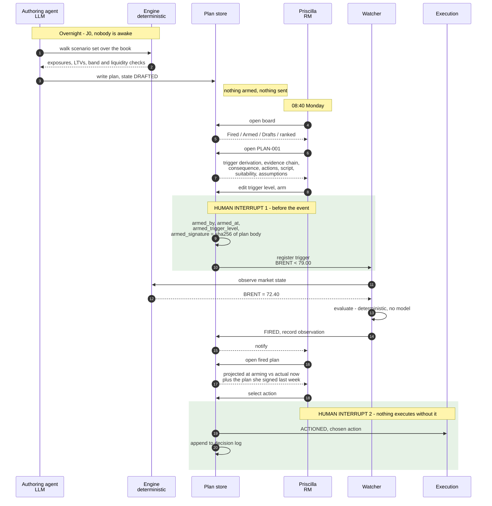
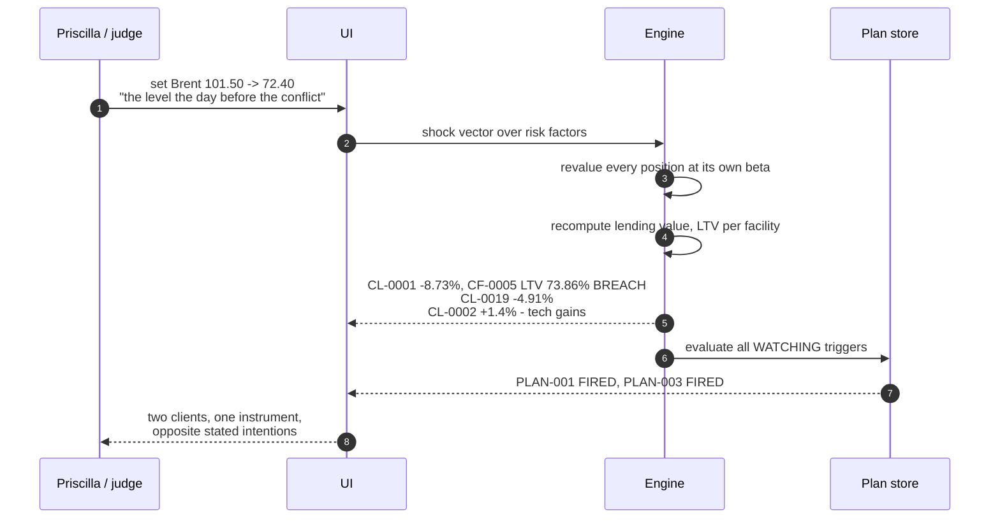
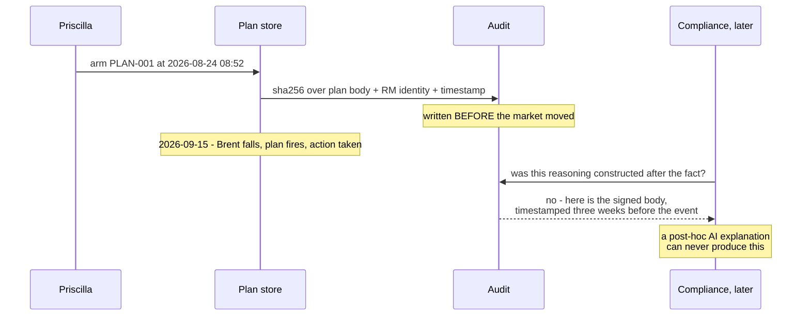

# Sequences

## The loop: author, arm, watch, fire, act

```mermaid
sequenceDiagram
    autonumber
    participant A as Authoring agent<br/>LLM
    participant E as Engine<br/>deterministic
    participant S as Plan store
    participant P as Priscilla<br/>RM
    participant W as Watcher
    participant X as Execution

    Note over A,E: Overnight - J0, nobody is awake
    A->>E: walk scenario set over the book
    E-->>A: exposures, LTVs, band and liquidity checks
    A->>S: write plan, state DRAFTED
    Note right of S: nothing armed, nothing sent

    Note over P: 08:40 Monday
    P->>S: open board
    S-->>P: Fired / Armed / Drafts / ranked
    P->>S: open PLAN-001
    S-->>P: trigger derivation, evidence chain,<br/>consequence, actions, script,<br/>suitability, assumptions
    P->>S: edit trigger level, arm

    rect rgb(230,242,230)
        Note over P,S: HUMAN INTERRUPT 1 - before the event
        S->>S: armed_by, armed_at,<br/>armed_trigger_level,<br/>armed_signature = sha256 of plan body
        S->>W: register trigger<br/>BRENT < 79.00
    end

    W->>E: observe market state
    E-->>W: BRENT = 72.40
    W->>W: evaluate - deterministic, no model
    W->>S: FIRED, record observation
    S-->>P: notify

    P->>S: open fired plan
    S-->>P: projected at arming vs actual now<br/>plus the plan she signed last week
    P->>S: select action

    rect rgb(230,242,230)
        Note over P,X: HUMAN INTERRUPT 2 - nothing executes without it
        S->>X: ACTIONED, chosen action
        S->>S: append to decision log
    end
```

## The dial: one turn, two clients

```mermaid
sequenceDiagram
    autonumber
    participant P as Priscilla / judge
    participant U as UI
    participant E as Engine
    participant S as Plan store

    P->>U: set Brent 101.50 -> 72.40<br/>"the level the day before the conflict"
    U->>E: shock vector over risk factors
    E->>E: revalue every position at its own beta
    E->>E: recompute lending value, LTV per facility
    E-->>U: CL-0001 -8.73%, CF-0005 LTV 73.86% BREACH<br/>CL-0019 -4.91%<br/>CL-0002 +1.4% - tech gains
    E->>S: evaluate all WATCHING triggers
    S-->>U: PLAN-001 FIRED, PLAN-003 FIRED
    U-->>P: two clients, one instrument,<br/>opposite stated intentions
```

## Why the arming signature matters

```mermaid
sequenceDiagram
    participant P as Priscilla
    participant S as Plan store
    participant Aud as Audit
    participant C as Compliance, later

    P->>S: arm PLAN-001 at 2026-08-24 08:52
    S->>Aud: sha256 over plan body + RM identity + timestamp
    Note over Aud: written BEFORE the market moved

    Note over S: 2026-09-15 - Brent falls, plan fires, action taken

    C->>Aud: was this reasoning constructed after the fact?
    Aud-->>C: no - here is the signed body,<br/>timestamped three weeks before the event
    Note over C: a post-hoc AI explanation<br/>can never produce this
```
