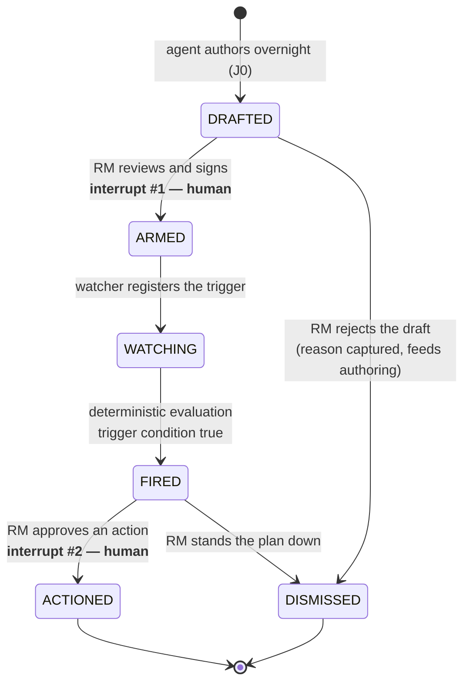

# Plan state machine

`STALE` is deliberately not implemented. Everything else is.

## Transitions

| From | To | Actor | Writes | Guard |
|---|---|---|---|---|
| — | `DRAFTED` | agent | plan body, `authored.by/at/based_on_snapshot` | plan validates against `plan.schema.json` |
| `DRAFTED` | `ARMED` | **RM** | `armed_by`, `armed_at`, `armed_trigger_level`, `armed_signature` | RM identity present; trigger level numeric and on an observable variable |
| `DRAFTED` | `DISMISSED` | **RM** | `resolution=DISMISSED`, `resolution_reason` | reason non-empty |
| `ARMED` | `WATCHING` | system | registers `(variable, operator, level)` with the watcher | signature present |
| `WATCHING` | `FIRED` | **system, deterministic** | `fired_at`, `fired_observation` | trigger expression evaluates true against observed market state |
| `FIRED` | `ACTIONED` | **RM** | `resolution=ACTIONED`, chosen action rank | an action is selected |
| `FIRED` | `DISMISSED` | **RM** | `resolution=DISMISSED`, `resolution_reason` | reason non-empty |

Every transition appends to `governance.decision_log`: `{at, actor, from, to, note}`.
The log is append-only. Nothing is ever edited in place.

## The two human interrupts

Only two transitions are performed by a person, and they are the two that matter:

1. **`DRAFTED → ARMED`.** The RM reviews reasoning she can inspect and signs it. This happens
   *before* the market moves. `armed_signature` is a sha256 over the canonical plan body at
   arming time — so what she approved cannot be quietly rewritten afterwards, and the approval
   provably predates the outcome. A post-hoc AI explanation can always be accused of
   rationalising a result it already knew. This one cannot.

2. **`FIRED → ACTIONED`.** Nothing executes without it.

Everything between them is arithmetic.

## The rule to say out loud

> **A trigger is never evaluated by a model.**

`trigger.evaluated_by` is a schema constant — `"deterministic"` — so a plan whose trigger claimed
to be model-evaluated would fail validation. The model authors prose, proposes exposure edges for
human review, and narrates. It does not decide, and it does not act.

## Editing at arming time

The RM may change `trigger.level` before arming. The drafted level is preserved in `trigger.level`;
the level she actually signed is `governance.armed_trigger_level`, and the watcher uses hers.
Both appear on the fired card, so the difference between what the machine proposed and what the
human approved is always visible.
